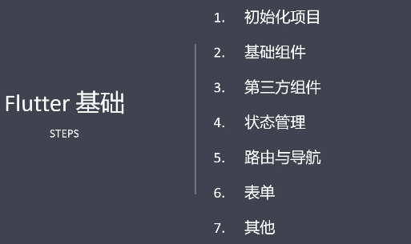


### Flutter setting Android SDK and Android Studio path


**执行如下命令：**

```bash
 flutter config --android-sdk /path/to/android/sdk
 flutter config --android-studio-dir /path/to/android/studio
 
 flutter config --android-sdk 'D:\development\Android\Sdk'
 flutter config --android-studio-dir 'D:\development\Android\Android Studio'
```


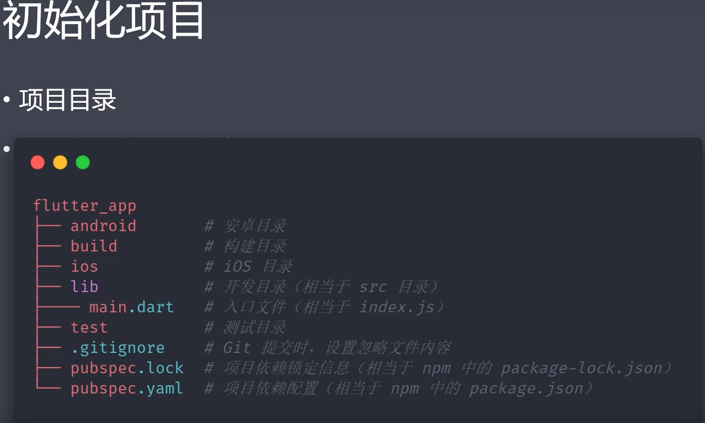


### [flutter使用本地gradle配置](https://www.cnblogs.com/fengfenghuifei/p/10084501.html)


Path:	`android\gradle\wrapper\gradle-wrapper.properties`


```bash
# network config
# distributionUrl=https\://services.gradle.org/distributions/gradle-6.7-all.zip
# distributionUrl=https\://services.gradle.org/distributions/gradle-7.1-all.zip

# local config
distributionUrl=file:///D:/development/Android/Grable//gradle-6.7.1-all.zip
```


simple example:

```dart
import 'package:flutter/material.dart';

void main() {
  runApp(Center(
    child: Text(
      'Hello Flutter',
      textDirection: TextDirection.ltr,
    ),
  ));
}
```

Encapsulation:

```dart
void main() {
  runApp(MyApp());
}

class MyApp extends StatelessWidget {
  const MyApp({Key? key}) : super(key: key);

  @override
  Widget build(BuildContext context) {
    return Container(
      child: Center(
        child: Text(
          'Hello Flutter',
          textDirection: TextDirection.ltr,
        ),
      ),
    );
  }
}
```


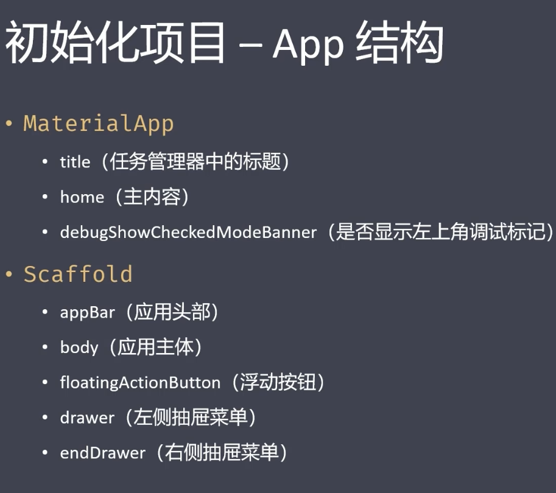


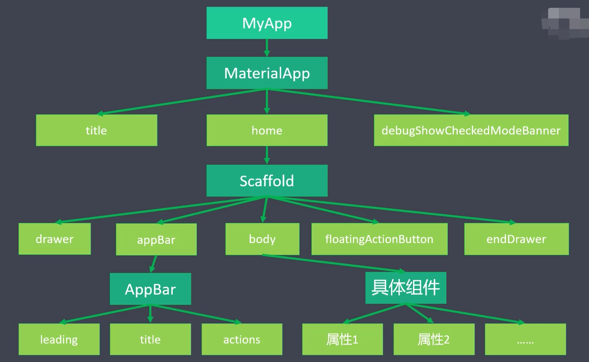


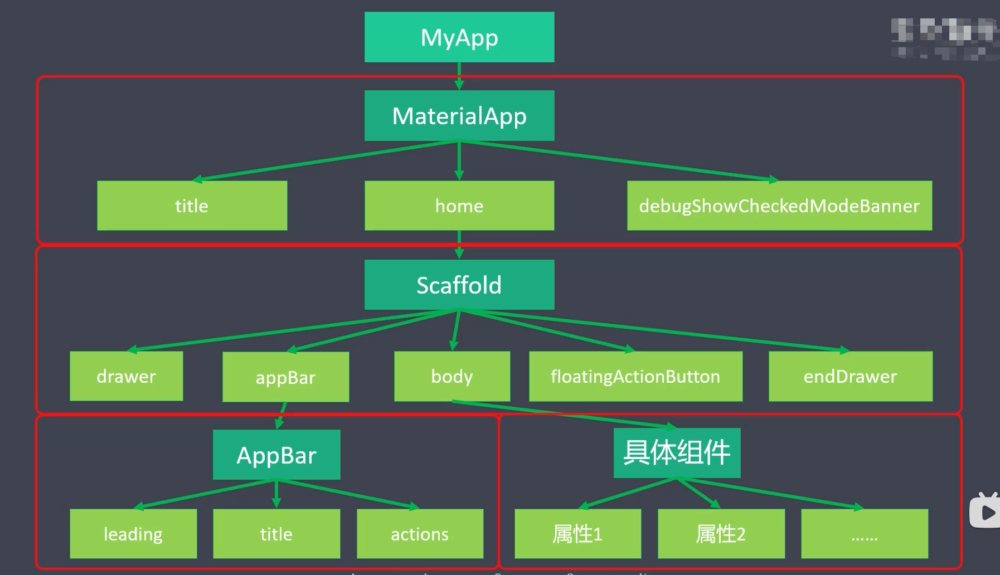


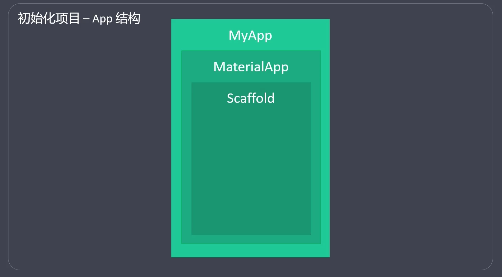


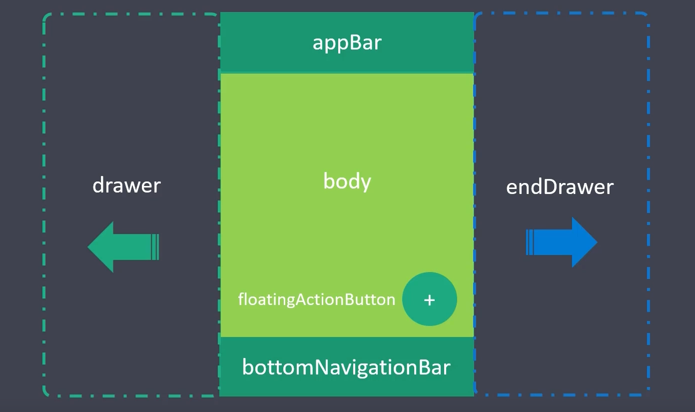


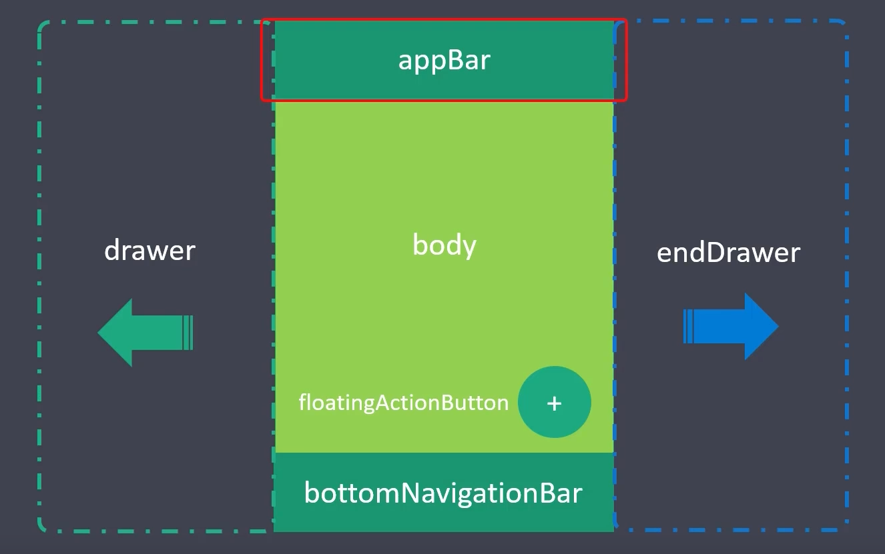


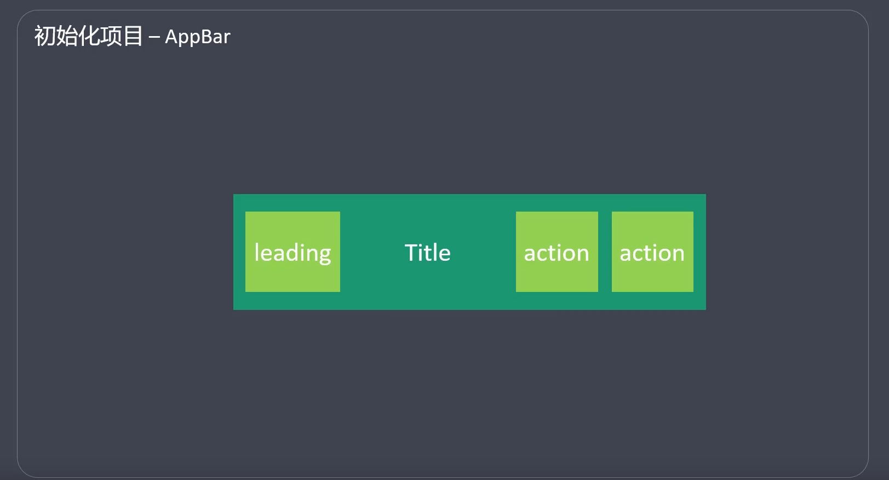


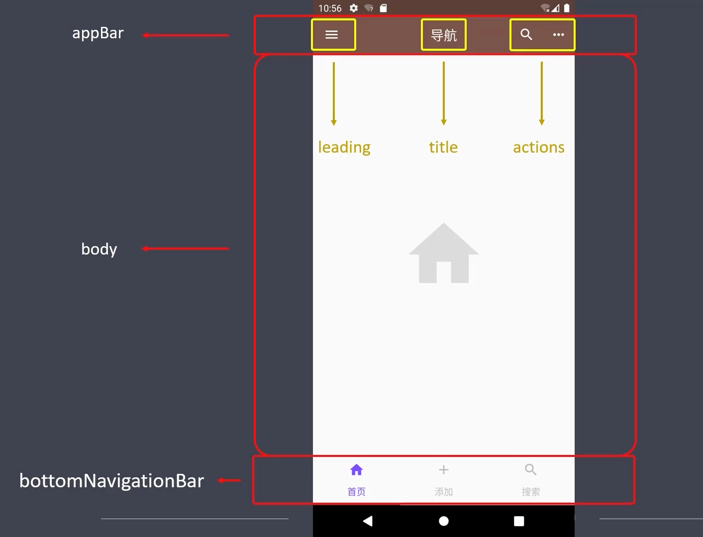


Material design;


```dart
void main() {
  runApp(MyApp());
}

class MyApp extends StatelessWidget {
  const MyApp({Key? key}) : super(key: key);

  @override
  Widget build(BuildContext context) {
    return MaterialApp(
      title: 'Flluter Show',
      home: HelloFlutter(),
    );
  }
}

class HelloFlutter extends StatelessWidget {
  const HelloFlutter({Key? key}) : super(key: key);

  @override
  Widget build(BuildContext context) {
    return Container(
      child: Center(
        child: Text(
          'Hello Flutter',
          textDirection: TextDirection.ltr,
        ),
      ),
    );
  }
}
```


```dart
import 'package:flutter/material.dart';

void main() {
  runApp(MyApp());
}

class MyApp extends StatelessWidget {
  const MyApp({Key? key}) : super(key: key);

  @override
  Widget build(BuildContext context) {
    return MaterialApp(
      title: 'Flluter Show',
      home: Home(),
      debugShowCheckedModeBanner: false,
    );
  }
}

class Home extends StatelessWidget {
  const Home({Key? key}) : super(key: key);

  @override
  Widget build(BuildContext context) {
    return Scaffold(
      appBar: AppBar(
        title: Text('首页'),
        // actions: [],),
      ),
      body: HelloFlutter(),
    );
  }
}

class HelloFlutter extends StatelessWidget {
  const HelloFlutter({Key? key}) : super(key: key);

  @override
  Widget build(BuildContext context) {
    return Container(
      child: Center(
        child: Text(
          'Hello Flutter',
          textDirection: TextDirection.ltr,
        ),
      ),
    );
  }
}
```


```dart
void main() {
  runApp(MyApp());
}

class MyApp extends StatelessWidget {
  const MyApp({Key? key}) : super(key: key);

  @override
  Widget build(BuildContext context) {
    return MaterialApp(
      title: 'Flluter Show',
      home: Home(),
      debugShowCheckedModeBanner: false,
    );
  }
}

class Home extends StatelessWidget {
  const Home({Key? key}) : super(key: key);

  @override
  Widget build(BuildContext context) {
    return Scaffold(
      appBar: AppBar(
        title: Text('首页'),
        leading: Icon(Icons.menu),
        actions: [Icon(Icons.settings)],
        centerTitle: true,
        elevation: 0.0,
      ),
      body: HelloFlutter(),
    );
  }
}

class HelloFlutter extends StatelessWidget {
  const HelloFlutter({Key? key}) : super(key: key);

  @override
  Widget build(BuildContext context) {
    return Container(
      child: Center(
        child: Text(
          'Hello Flutter',
          textDirection: TextDirection.ltr,
        ),
      ),
    );
  }
}

```


分库：

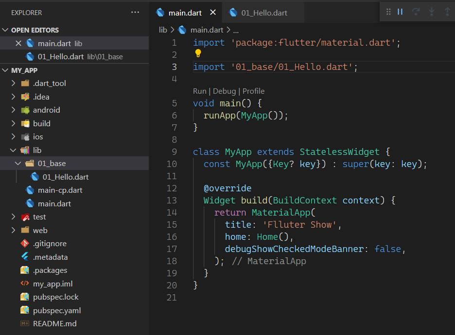
