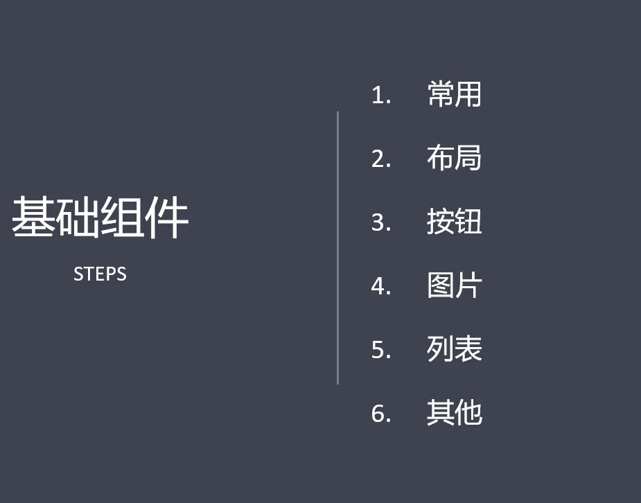
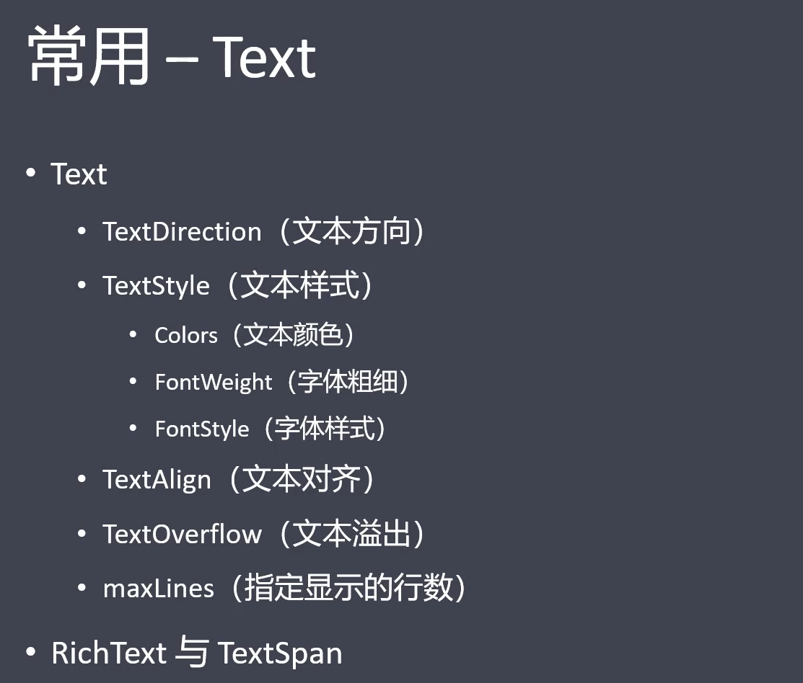
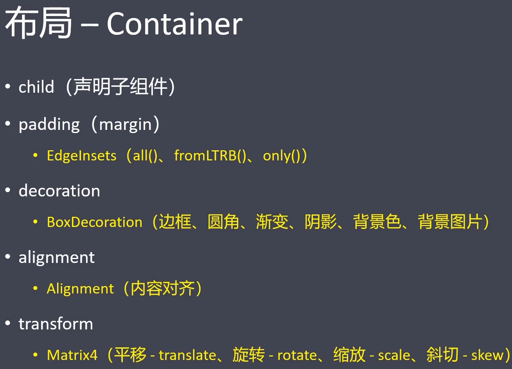
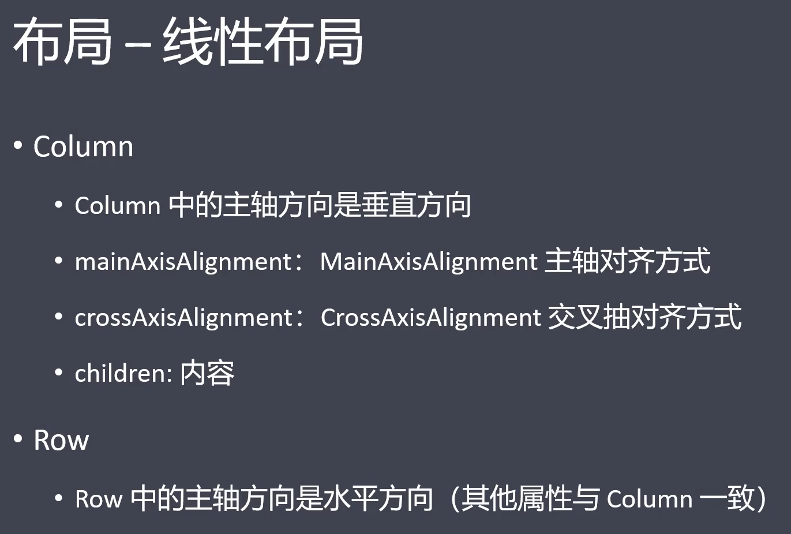
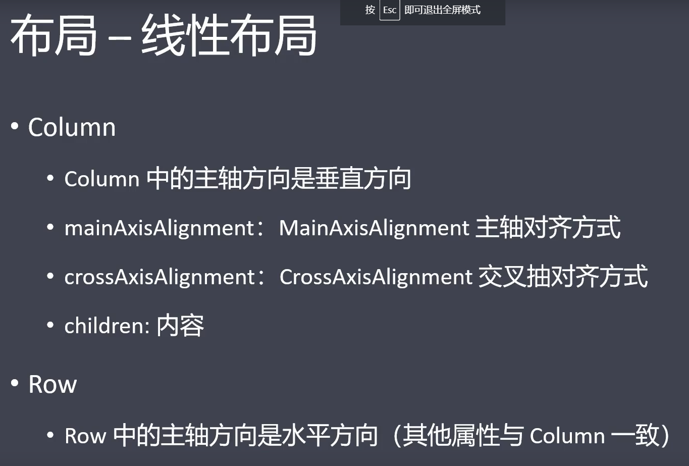
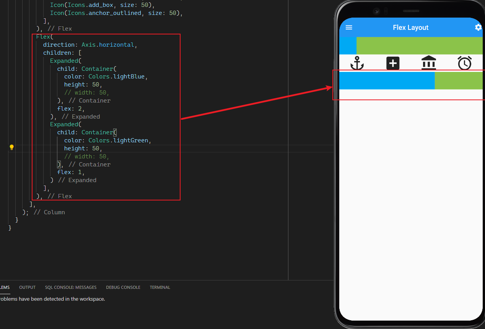
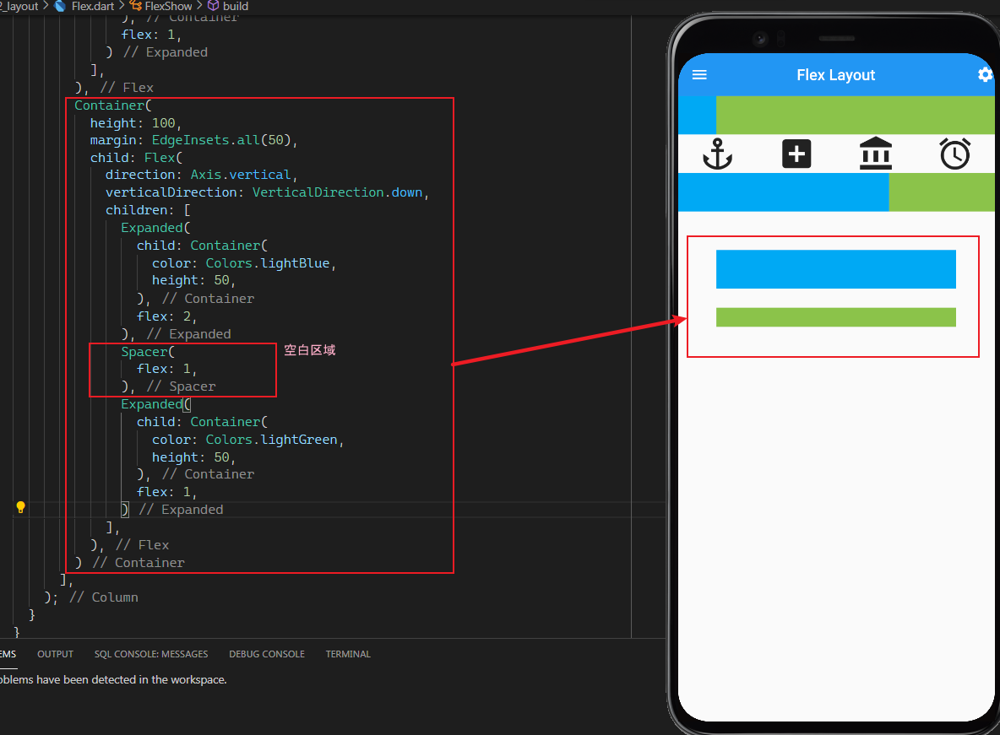

```dart
import 'package:flutter/material.dart';

class Home extends StatelessWidget {
  const Home({Key? key}) : super(key: key);

  @override
  Widget build(BuildContext context) {
    return Scaffold(
      appBar: AppBar(
        title: Text('Flex Layout'),
        leading: Icon(Icons.menu),
        actions: [Icon(Icons.settings)],
        centerTitle: true,
        elevation: 0.0,
      ),
      body: FlexShow(),
    );
  }
}

class FlexShow extends StatelessWidget {
  const FlexShow({Key? key}) : super(key: key);

  @override
  Widget build(BuildContext context) {
    return Column(
      children: [
        Row(
          children: [
            Container(
              color: Colors.lightBlue,
              height: 50,
              width: 50, // must be specific width can display
            ),
            Expanded(
              child: Container(
                color: Colors.lightGreen,
                height: 50,
              ),
            ),
          ],
        ),
        // ------------------------
        Flex(
          direction: Axis.horizontal,
          mainAxisAlignment: MainAxisAlignment.spaceAround,
          // 水平方向上排列方式
          textDirection: TextDirection.rtl,
          children: [
            Icon(Icons.access_alarm, size: 50),
            Icon(Icons.account_balance, size: 50),
            Icon(Icons.add_box, size: 50),
            Icon(Icons.anchor_outlined, size: 50),
          ],
        )
        // ------------------------
      ],
    );
  }
}
```


```dart
class FlexShow extends StatelessWidget {
  const FlexShow({Key? key}) : super(key: key);

  @override
  Widget build(BuildContext context) {
    return Column(
      children: [
        Row(
          children: [
            Container(
              color: Colors.lightBlue,
              height: 50,
              width: 50, // must be specific width can display
            ),
            Expanded(
              child: Container(
                color: Colors.lightGreen,
                height: 50,
              ),
            ),
          ],
        ),
        Flex(
          direction: Axis.horizontal,
          mainAxisAlignment: MainAxisAlignment.spaceAround,
          // 水平方向上排列方式
          textDirection: TextDirection.rtl,
          children: [
            Icon(Icons.access_alarm, size: 50),
            Icon(Icons.account_balance, size: 50),
            Icon(Icons.add_box, size: 50),
            Icon(Icons.anchor_outlined, size: 50),
          ],
        ),
        // ------------------------
        Flex(
          direction: Axis.horizontal,
          children: [
            Expanded(
              child: Container(
                color: Colors.lightBlue,
                height: 50,
                // width: 50,
              ),
              flex: 2,
            ),
            Expanded(
              child: Container(
                color: Colors.lightGreen,
                height: 50,
                // width: 50,
              ),
              flex: 1,
            )
          ],
        ),
        // ------------------------
      ],
    );
  }
}
```








```dart
class FlexShow extends StatelessWidget {
  const FlexShow({Key? key}) : super(key: key);

  @override
  Widget build(BuildContext context) {
    return Column(
      children: [
        Row(
          children: [
            Container(
              color: Colors.lightBlue,
              height: 50,
              width: 50, // must be specific width can display
            ),
            Expanded(
              child: Container(
                color: Colors.lightGreen,
                height: 50,
              ),
            ),
          ],
        ),
        Flex(
          direction: Axis.horizontal,
          mainAxisAlignment: MainAxisAlignment.spaceAround,
          // 水平方向上排列方式
          textDirection: TextDirection.rtl,
          children: [
            Icon(Icons.access_alarm, size: 50),
            Icon(Icons.account_balance, size: 50),
            Icon(Icons.add_box, size: 50),
            Icon(Icons.anchor_outlined, size: 50),
          ],
        ),
        Flex(
          direction: Axis.horizontal,
          children: [
            Expanded(
              child: Container(
                color: Colors.lightBlue,
                height: 50,
                // width: 50,
              ),
              flex: 2,
            ),
            Expanded(
              child: Container(
                color: Colors.lightGreen,
                height: 50,
                // width: 50,
              ),
              flex: 1,
            )
          ],
        ),
        // ----------------------------------------
        Container(
          height: 100,
          margin: EdgeInsets.all(50),
          child: Flex(
            direction: Axis.vertical,
            verticalDirection: VerticalDirection.down,
            children: [
              Expanded(
                child: Container(
                  color: Colors.lightBlue,
                  height: 50,
                ),
                flex: 2,
              ),
              Spacer(
                flex: 1,
              ),
              Expanded(
                child: Container(
                  color: Colors.lightGreen,
                  height: 50,
                ),
                flex: 1,
              )
            ],
          ),
        )
       // ---------------------------------------- 
      ],
    );
  }
}
```

