## 课堂笔记

[toc]

## 0. 课程介绍

typora

### 时间安排

上午:  8:30  -- 12:30 (4节课)

下午: 14:30 --- 18:30 (4 节课, 前两节上课, 后两节自习答疑)

晚上: 19:30 -- 21:00 

### 每天视频目录说明

### 知识掌握程度

- 知道（了解）：只要知道它是怎么样的概念、理论就够了，不需要对它进行更多的讨论。
- 理解：不仅要知道概念，而且要知道来龙去脉。
- 掌握：不仅要知道概念，而且要知道能解决什么问题，甚至要知道在出现不同场景时，能够灵活运用。
- 应用：能够重复操作达成结果，或对某一个结论会用即可，而对这个概念本身的来龙去脉不做追究。

课程介绍

今日课程介绍

## 1. 计算机的组成[了解]

- 硬件系统
  - 主机部分
    - CPU (中央处理器)
    - 内存(4G, 8G, 16G 32G 64G)
  - 外设部分
    - 输入设备
      - 键盘
      - 鼠标
    - 输出设备
      - 显示器
      - 音响
    - 外存储器
      - 硬盘
- 软件系统
  - 系统软件
    - ==操作系统:  控制硬件运行, 支持其他软件运行==
      - 分类:  
        - Windows(7 8 10)
        - Mac
        - Linux
        - Android
        - iOS
  - 应用软件: 自己安装的使用的软件

## 2.计算机如何处理程序的[了解]

计算机想要运行程序,需要将软件(指令,数据)加载到内存中.

CPU 只能和内存进行交互.

## 3. 编程语言[了解]

计算机只认识 0 和 1.

编程语言: 就是计算机和人类沟通交流的语言.

常见的编程语言:  python ,  C 语言  C++.

## 4. python 介绍 [了解]

- python 诞生与 1991年, 作者是龟叔
- python 解释器的官方实现版本是 C 语言实现
- python 的版本:
  - python2.x  官方已经停止维护
  - Python3.x


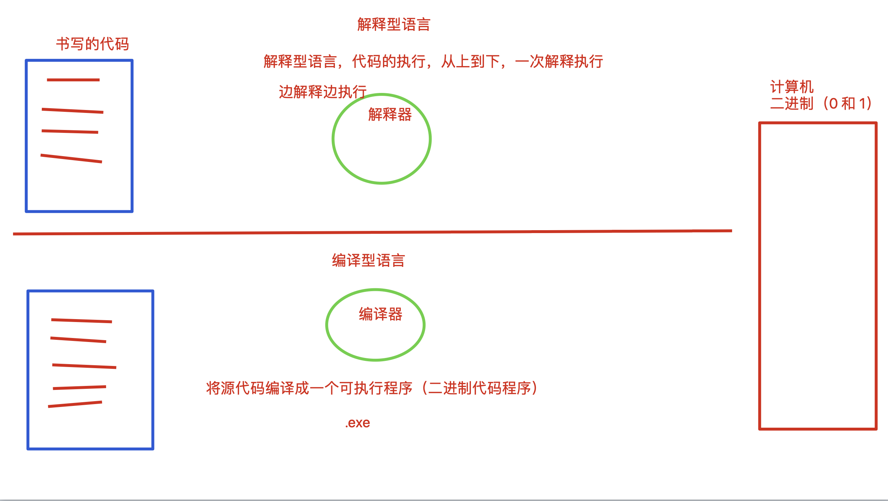

## 5. 第一个 python 程序[掌握]

> python:   python 解释器, 将 python 代码解释成计算机认识的语言.
>
> pycharm:  IDE(集成开发环境), 写代码的一个软件, 集成了写代码, 运行代码,代码调试等功能
>
> 写代码的软件除了使用 pycharm 之外,还可以使用 记事本,  sublime, vscode .... 

### 使用记事本(sublime)书写一个 python 代码

1. 新打开一个记事本程序

2. 书写 `print('hello world!')`, 注意,标点符号都是英文

3. 保存文件, 文件的后缀是`.py`

   

   

   

4. 打开 cmd 窗口,  执行代码 `python 代码文件名`

   

   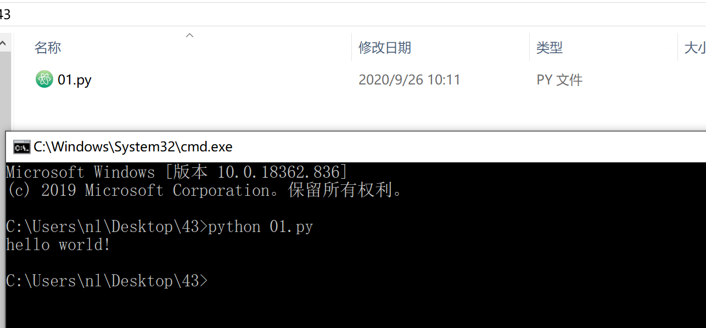


### 使用 pycharm 书写 python 代码

1. 打开 pycharm 软件

   

   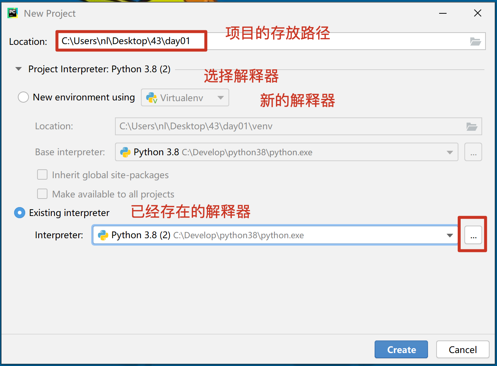

   

2. 创建代码文件

   

3. 书写代码 `print('hello world!')`

   

4. 运行代码, 右键运行

   

5. 查看运行结果

   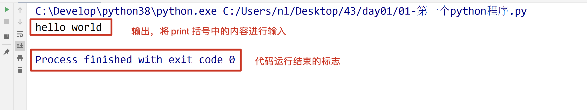


### pycharm 软件的基本设置


#### file 菜单


#### setting - 背景色

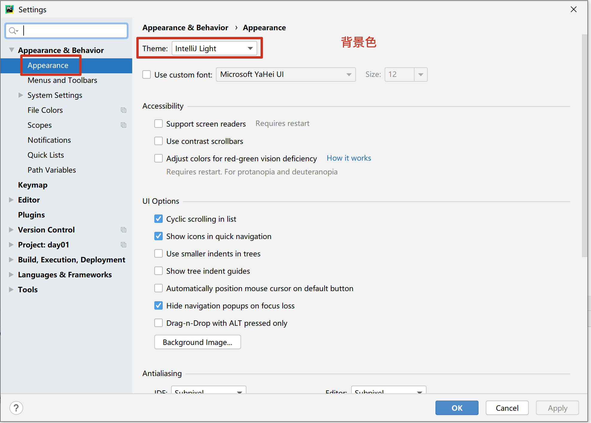

#### setting - 设置字体颜色和大小

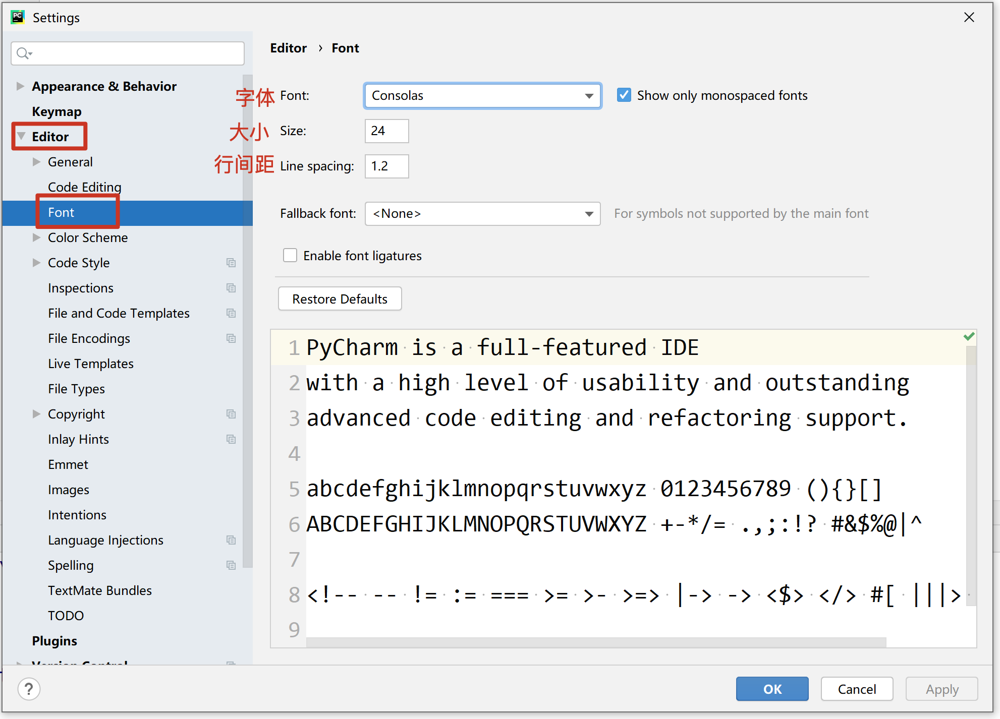

#### setting -- 设置解释器

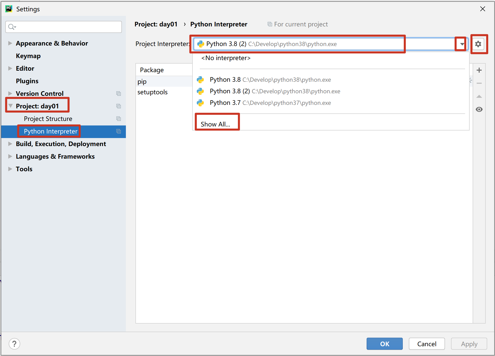

## 6. 注释[掌握]

- 注释是不会执行的
- 注释是对代码的解释说明,是让人看得
- 单行注释的快捷键/取消单行注释  `Ctrl /`,  可以一次选中多行,给其添加单行注释


## 7. 变量的定义和使用[掌握]

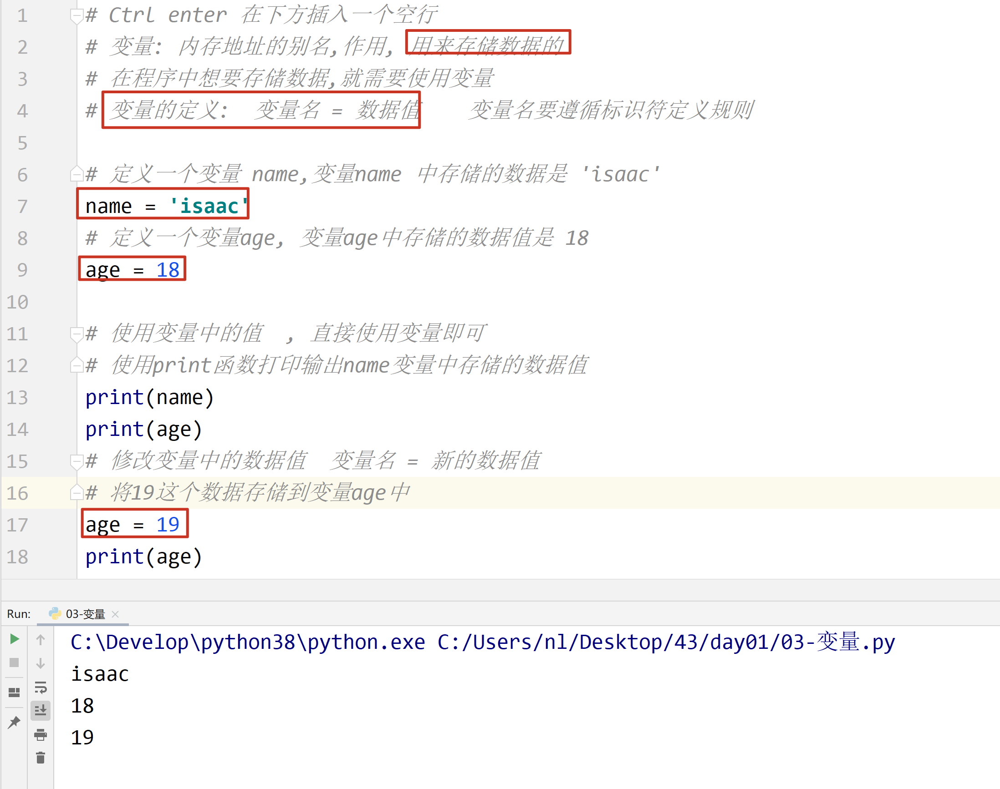

## 8. 数据类型[掌握]


## 9. 标识符和关键字[掌握]

- 标识符命名规则: ==由字母,数字和下划线组成,不能以数字开头==

- 变量的命名规范

  - 遵循标识符的规则
  - 见名知意
  - 使用下划线连接
  - 不能使用系统的关键字

- 关键字: 系统定义好的标识符,具有特殊的作用

  > 不需要刻意的记忆,后续课程中会逐渐学习

## 10. 输出[掌握]


## 11. 输入[掌握]

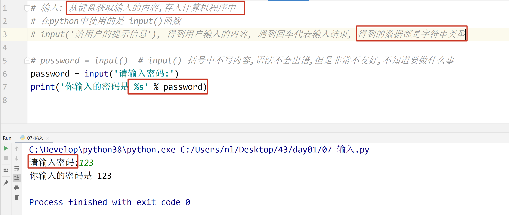

## 12. 数据类型转换[掌握]

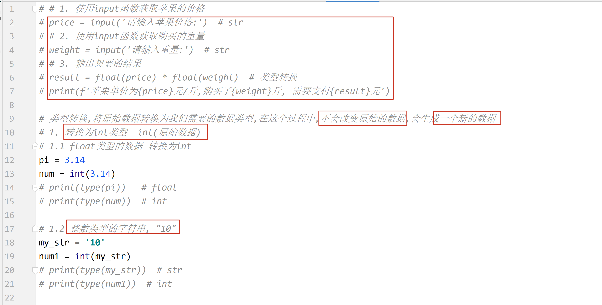

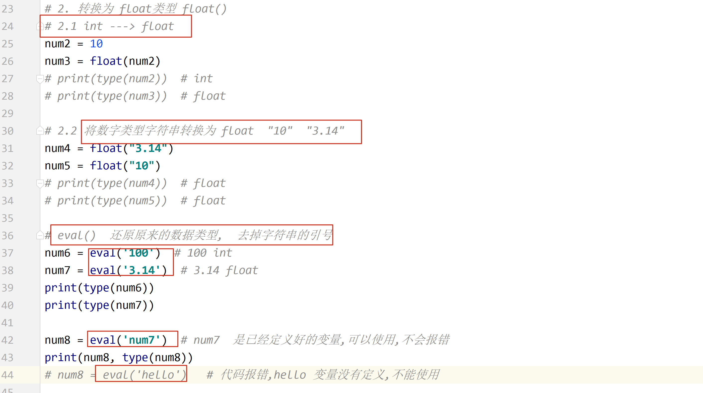

## 13. 运算符[掌握]

### 算术运算符

```
+ - * / 
// 整除(求商)
% 取余数
** 指数,幂运算
() 可以改变优先级
```

### 赋值运算符

```python
= 将等号右边的结果赋值给等号左边的变量
等号左边,必须是变量,不能是具体的数字
```

### 符合赋值运算符

```python
+=  c+=a  ===> c = c + a
```

### 比较运算符

> 比较运算符的结果是 bool 类型, 即 True,或者是 False

```python 
== 判断是否相等, 相等是 True. 不相等是 False
!= 判断是否不相等, 不相等是 True, 相等 False
>
<
>=
<=
```

### 逻辑运算符

> 逻辑运算符可以连接连个表达式, 两个表达式共同的结果决定最终的结果是 True,还是 False

```python 
and  逻辑与, 连接的两个条件都必须为 True,结果为 True,  一假为假
	如果第一个条件为 False,就不会再判断第二个条件
or   逻辑或, 连接的两个条件都为 False,结果为 False,    一真为真
	如果第一个条件为 True,第二个条件就不会再判断了
not  逻辑非, 取反,原来是 True,变为 False,原来是 False,变为 True
```


## PEP 8 规范

1. 单行注释#后边应该有一个空格

   

2. 代码文件的最后一行是空行

   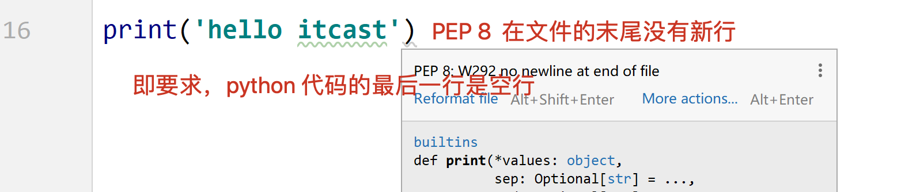

3. 行内注释需要两个空格

   


http://192.168.154.31:8000