## day02 课堂笔记

[toc]


## 0. 复习和反馈

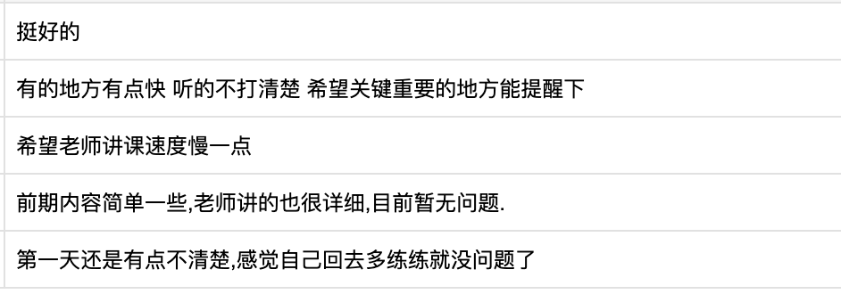

```python 
单引号和双引号是没有区别的

需要将数字类型的字符串转换为数字类型(int float ), 就可以使用 eval(), 也可以不适用,直接是所有 int()  或者 float()
```


## 1. if 判断语句

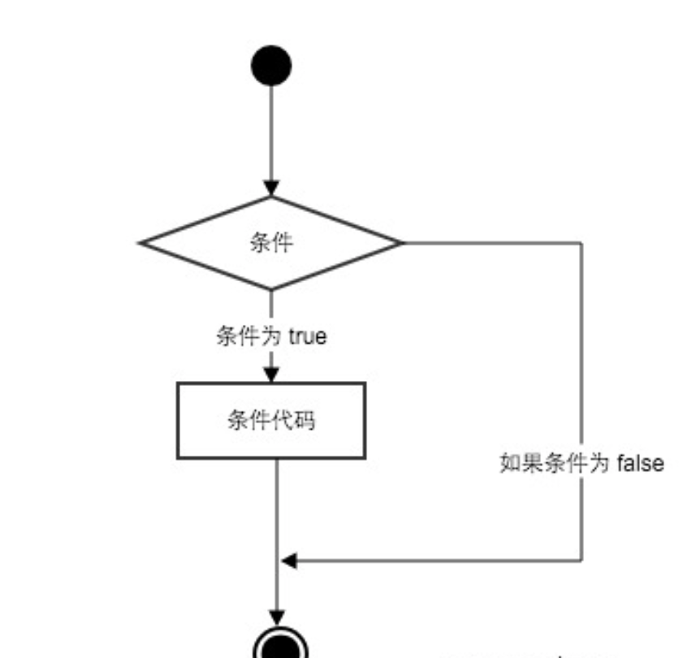

### If 判断的基本格式

```python
if 判断条件:
    判断条件为 True,会执行的代码
    判断条件为 True,会执行的代码
    ...

顶格书写的代码,代表和 if 判断没有关系
在 python 中使用缩进,代替代码的层级关系, 在 if 语句的缩进内,属于 if 语句的代码块(多行代码的意思)
```

> 案例需求：
>
> 1. 通过用户键盘输入，获取年龄
> 2. 判断年龄是否满足18岁，满足输出`哥18岁了，可以进入网吧为所欲为了`
> 3. 程序最后输出，`if 判断结束`(不管是否满足，都会输出)

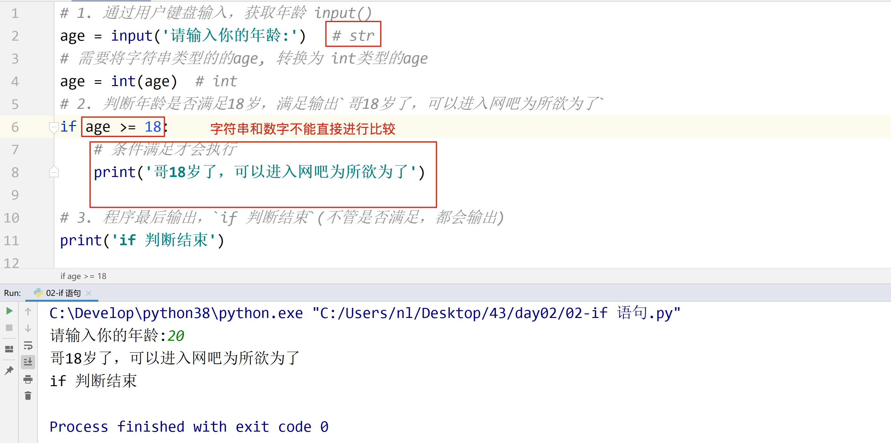

### if else 结构

```python 
if 判断条件:
    判断条件为 True,会执行的代码
    判断条件为 True,会执行的代码
    ...
else:
    判断条件为 False, 会执行的代码
    判断条件为 False, 会执行的代码
    .....
    
    
if 和 else 只会执行其中的一个,    
```

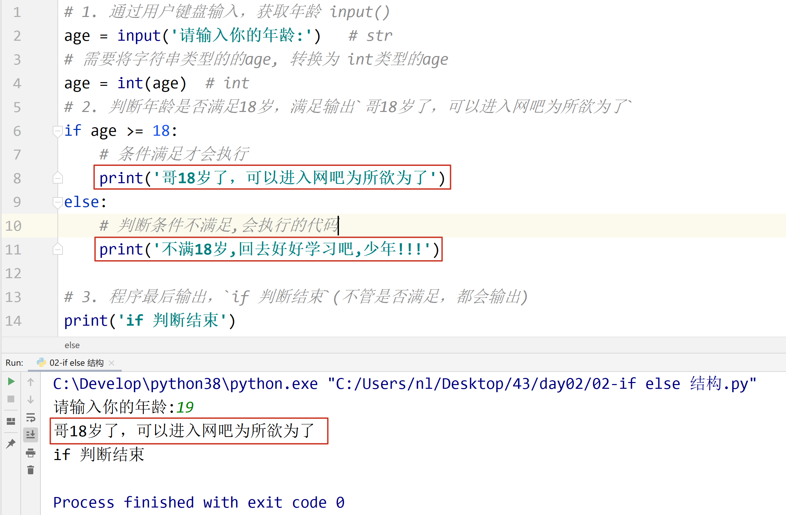


### Debug 调试

> 1. 可以查看代码的执行过程
> 2. 可以排查错误

步骤:

1. 打断点(一般可以在代码的开始打上断点,或者在查看代码的地方打断点)

2. 右键 debug 运行代码

   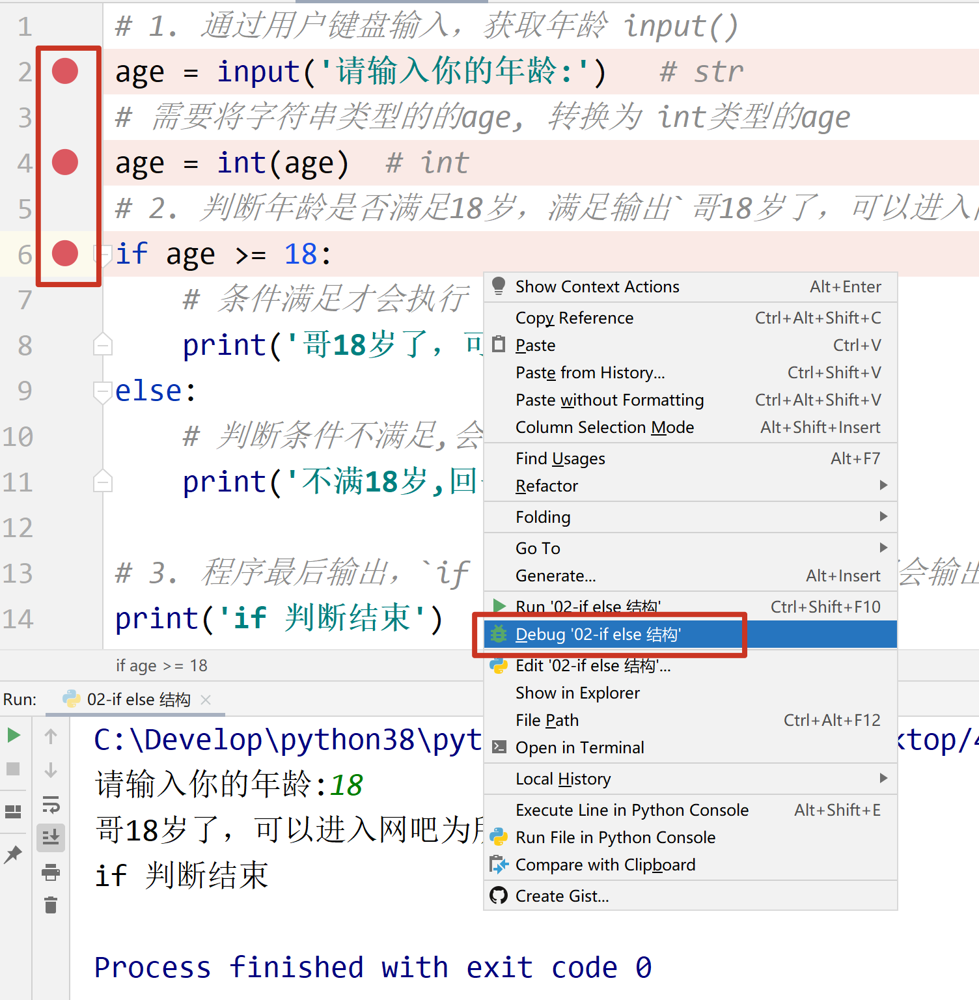

3. 点击 下一步, 查看代码执行的过程


### if elif 结构

```python 
if 	判断条件1:
    判断条件1成立,执行的代码
elif 判断条件2:
    判断条件1不成立,判断条件2 成立,会执行的代码
else:
    判断条件1和判断条件2都不成立,执行的代码
    
--------
if 判断条件1:
    判断条件1成立执行的代码
    
if 判断条件2:
    判断条件2 成立执行的代码
```


> 需求：
>
> 1. 成绩大于等于90 ，输出优秀
> 2. 成绩大于等于80，小于90，输出良好
> 3. 成绩大于等于60，小于80，输出及格
> 4. 小于60，输出不及格

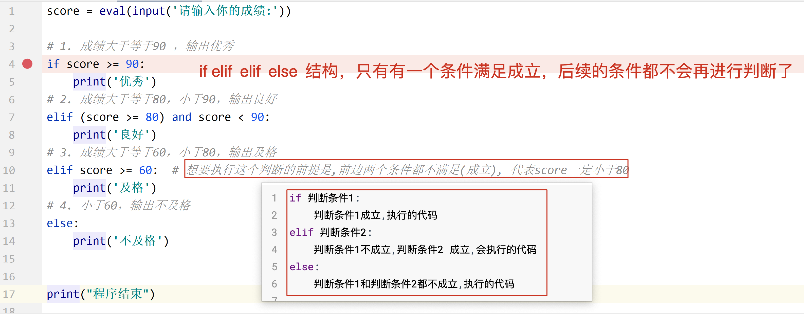


###  if 嵌套

```python
if 判断条件1:
    判断条件1 成立,会执行的代码
    if 判断条件2:
        判断条件1成立, 判断条件2成立执行的代码
    else:
        判断条件1成立, 判断条件2不成立执行的代码
else:
    判断条件1不成立,会执行的代码
```

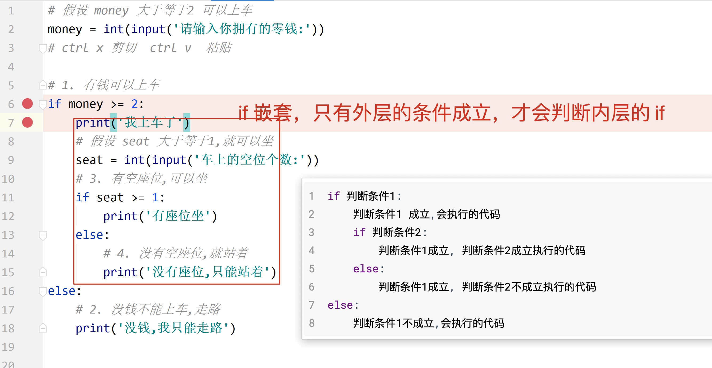

### 猜拳游戏

```python 
import random  # 导入随机数模块
# 产生 [a, b] 之间的随机整数,包含 a 和 b
num = random.randint(a, b) 
```

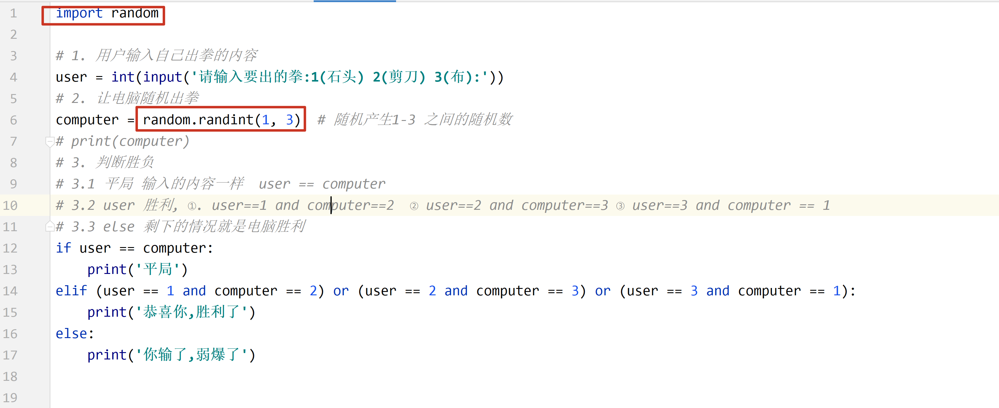

### 三目运算

> if else 结构变形

```python 
if 判断条件1:
    表达式1
else:
    表达式2
    
判断条件成立,执行表达式 1, 条件不成立,执行表达式 2

变量 = 表达式1 if 判断条件 else 表达式2  # 推荐使用扁平化代码

变量最终存储的结构是: 
    判断条件成立,表达式1的值, 
    条件不成立,表达式2的值
```

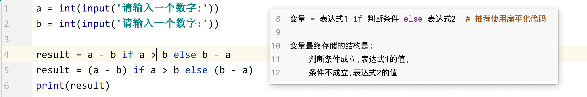

## 循环

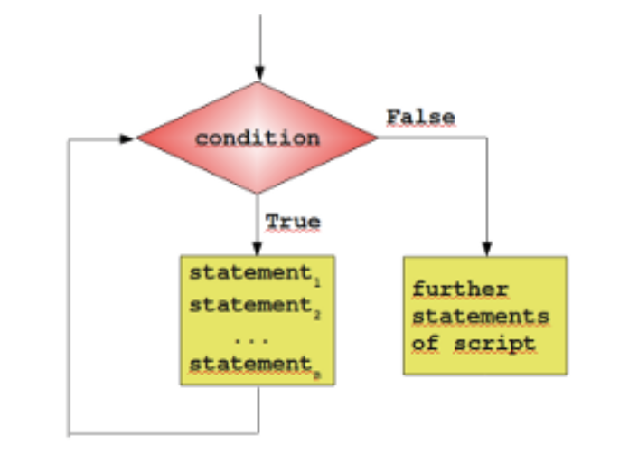

### 循环的基本语法

```python 
while 判断条件:
    判断条件成立,执行的代码
    判断条件成立,执行的代码
    
不在 while 的缩进内,代表和循环没有关系    

while 和 if 的区别:
    if 的代码块,条件成立,只会执行一次
    while 的代码块,只要条件成立,就会一直执行
```

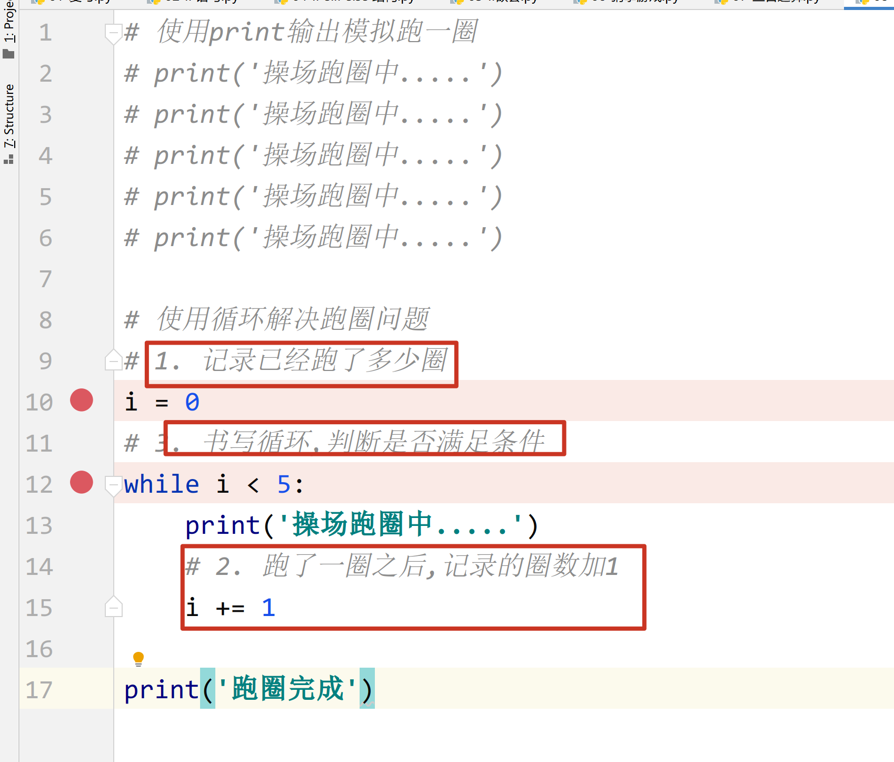

```python
while True:  # 无限循环
    代码
    
    
死循环: 相当于是代码的 bug,错误
无限循环: 人为书写的,故意这样写的
```

### 应用

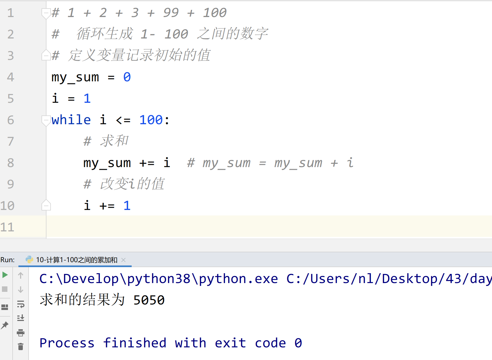

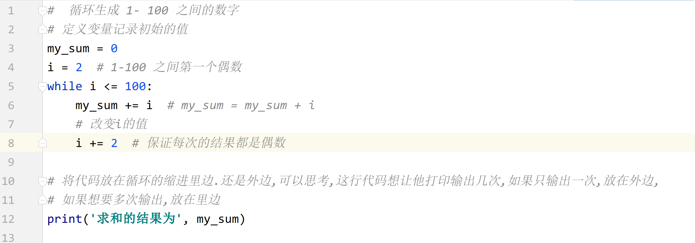

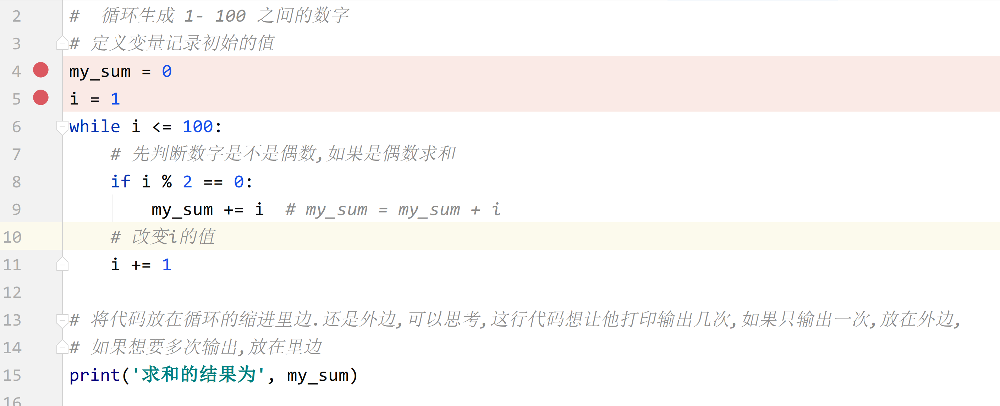

### 循环嵌套

```python 
while 判断条件1:
    代码1
    while 判断条件2:
        代码2

======
代码 1 执行一次,代码会执行多次
```

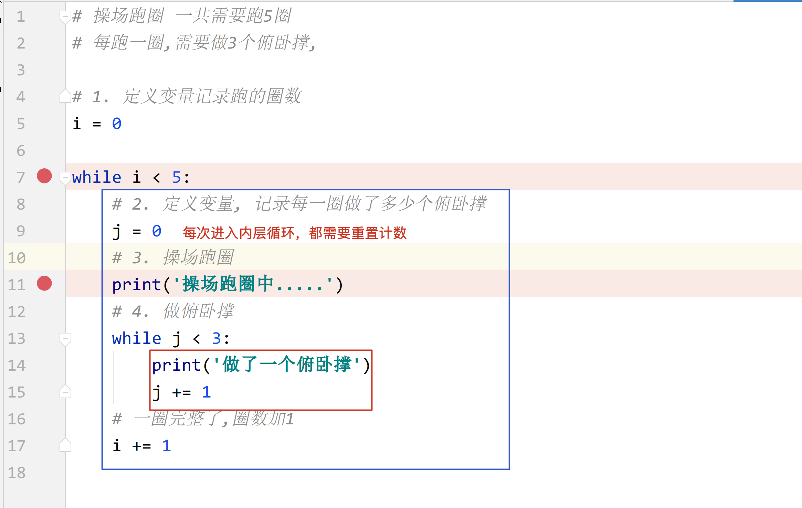

## for 循环遍历

```python
for 变量 in 字符串:
    代码
for 循环也称为 for 遍历,会将字符串中的字符全部取到    
```

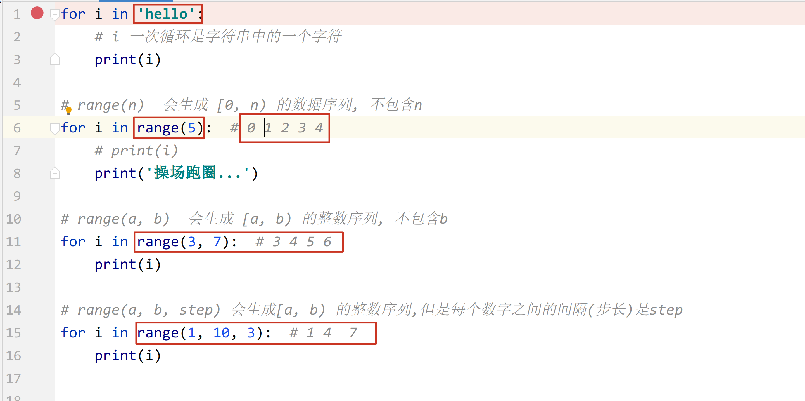


### 循环打印直角三角形

```
行   *个数
1	1
2	2
3	3
4	4
n	n
```

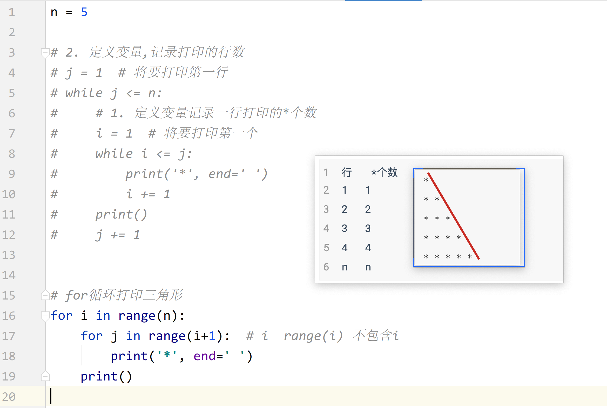


### Break 和 continue

```python
1. break 和 continue 是 python 两个关键字
2. break 和 continue 只能用在循环中
3. break 是终止循环的执行, 即循环代码遇到 break,就不再循环了
	continue 是结束本次循环,继续下一次循环, 即本次循环剩下的代码不再执行,但会进行下一次循环
```

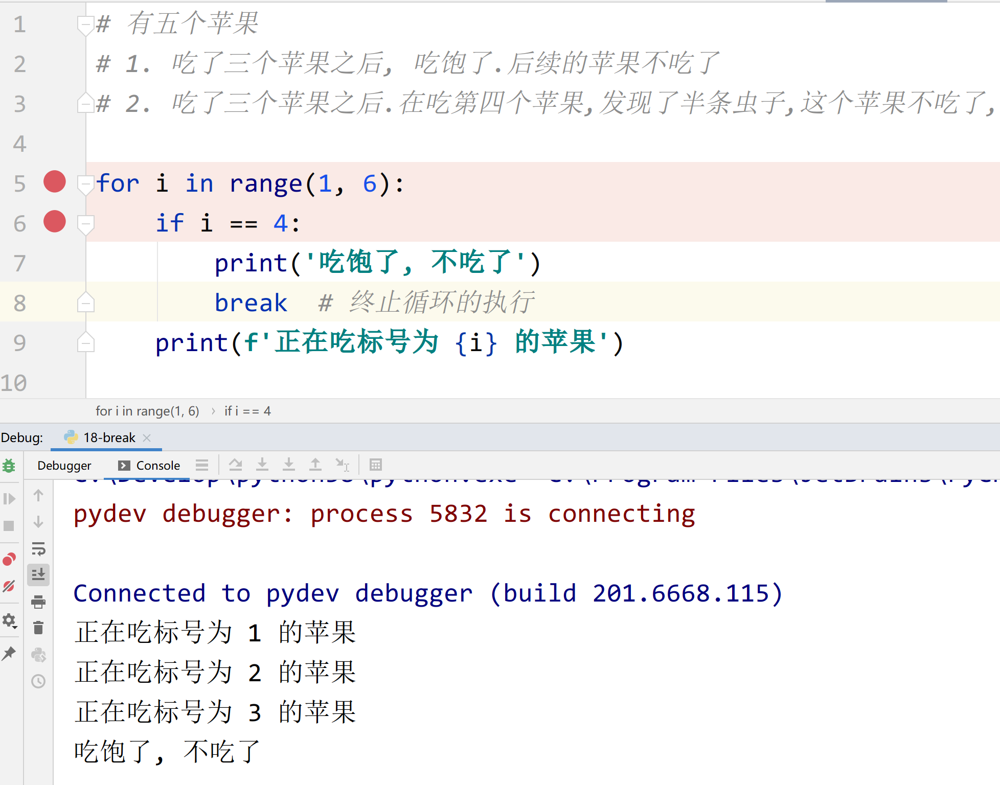


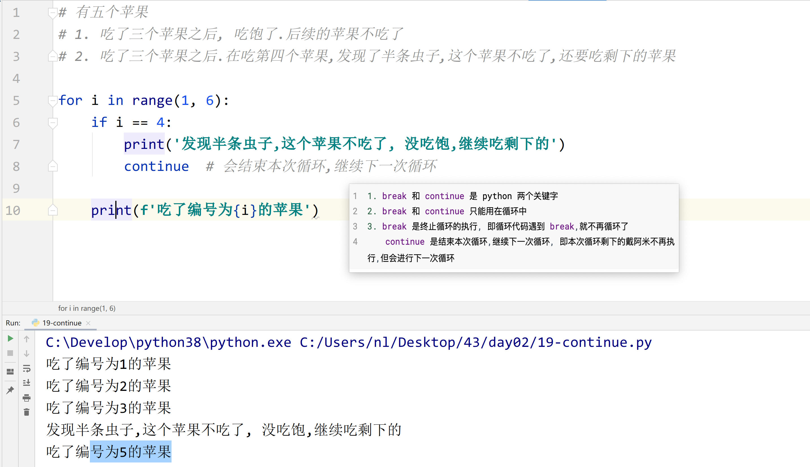


### 循环 else 结构

```python
for x in xx:
    if xxx:
        xx  # if 判断条件成立会执行
    else:
        xxx  # if 判断条件不成立,会执行
else:
    xxx  # for 循环代码运行结束,但是不是被 break 终止的时候会执行
    
需求:
    有一个字符串 'hello python', 想要判断这个字符串中有没有包含 p 这个字符,如果包含,就输出, 包含 p, 如果没有 p ,就输出,不包含
```

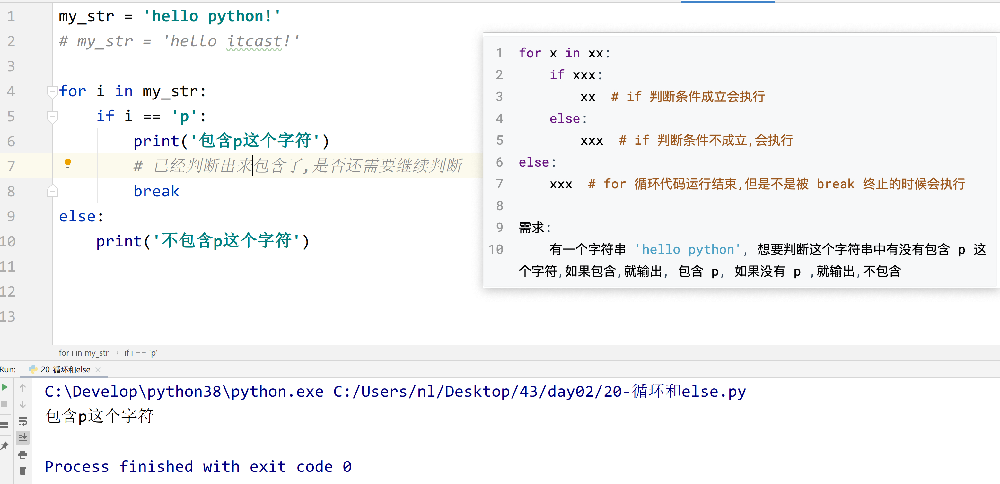


## 总结补充

```python
num = 76
使用代码的方法,求出这个数字的个位数和十位数
个位数: num % 10 
十位数: num // 10
    
    
判断 if elif  else 

if 判断条件:
    pass  # 占位,空代码 让代码不报错
elif 判断条件:
    pass
else:
    pass


循环: 重复做一件事 while   for
while 判断条件:
    pass

for i in xxx:
    pass

break 和 continue,
    
```


