## Day03 笔记

[toc]

## 复习和反馈

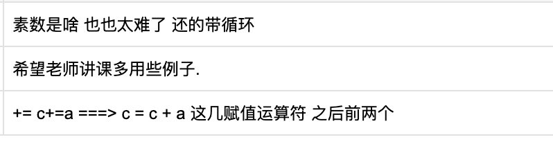

## 1. 字符串

### 1.1 字符串定义

```python
带引号的内容就是字符串.

在 python 中,字符串可以乘上一个整数, 
字符串 * num
```

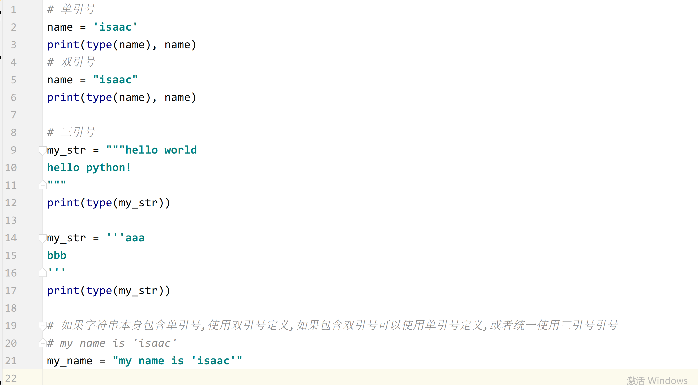

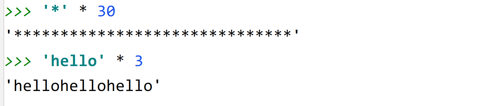

### 1.2 字符串的输出和输出

```python
# 输入 input()
input() 函数得到的内容就是字符串

# 输出 print() 函数 %s 
f-string 
```

### 1.3 下标


### 1.4 切片

```python
my_str[:]  得到和原来一样的字符串
my_str[::-1]  字符串的逆置
```


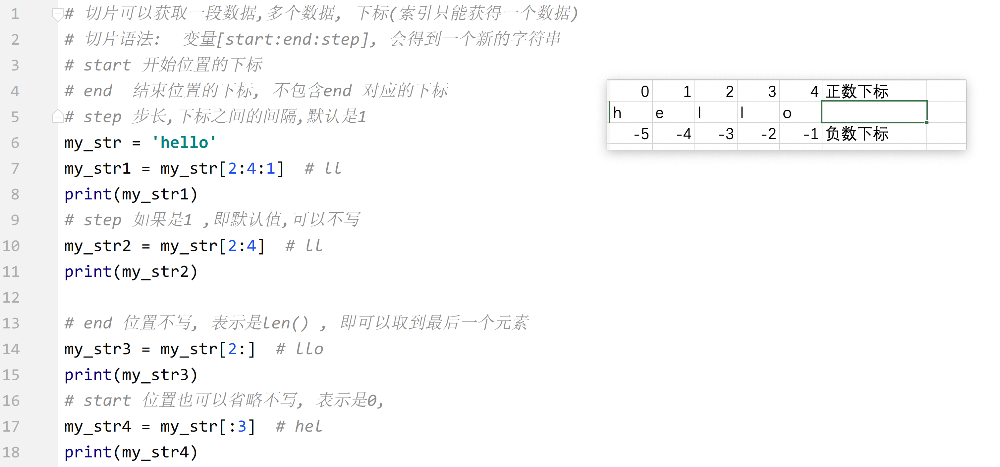

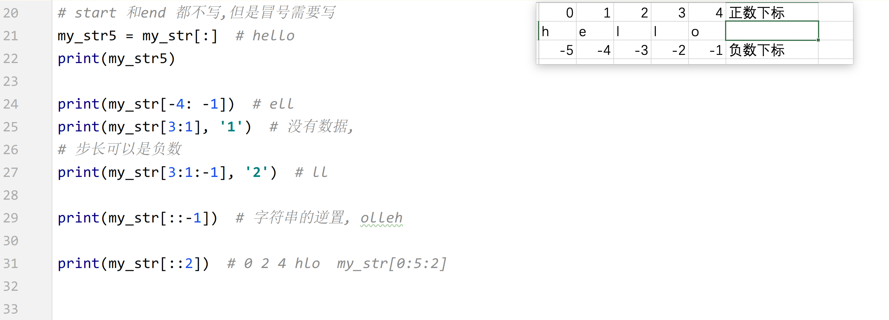

### 1.5 查找方法

#### find() & rfind()


#### index & rindex()

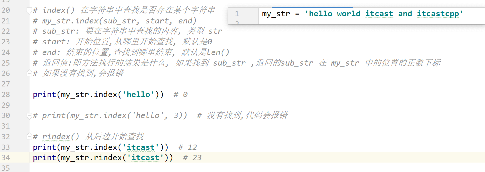

#### count()

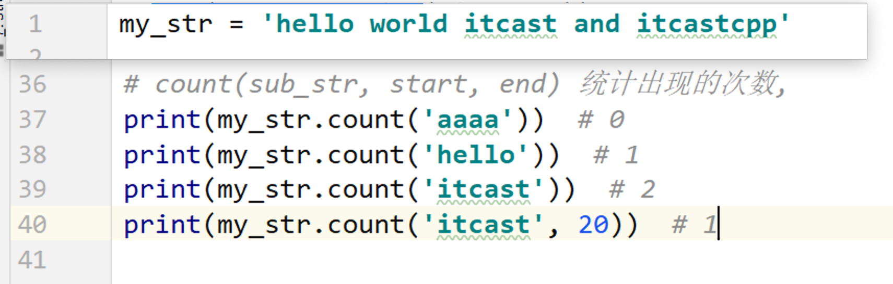

### 1.6 字符串替换方法 replace


#### 1.7 字符串分隔 split()


#### 1.8 字符串连接 join()

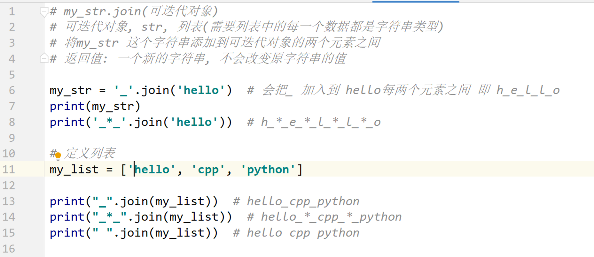

## 2. 列表

### 2.1 列表的定义和基本使用

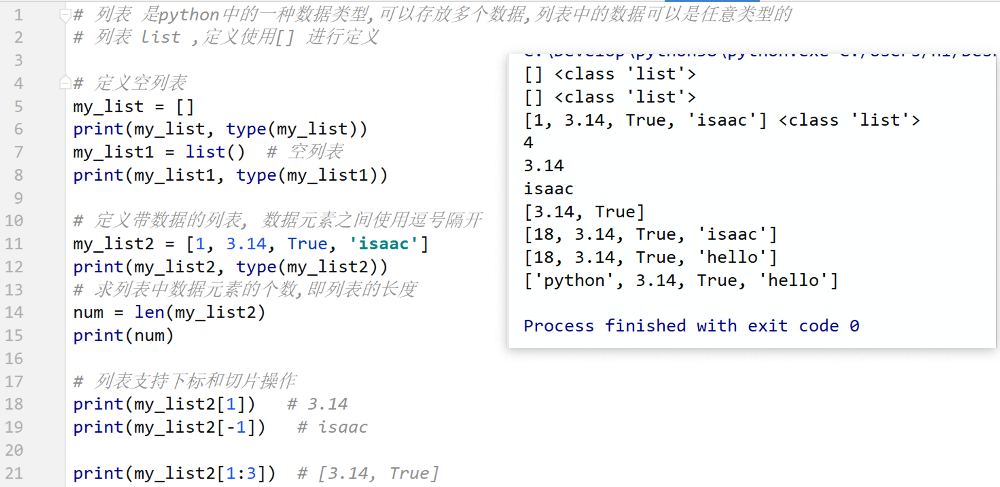

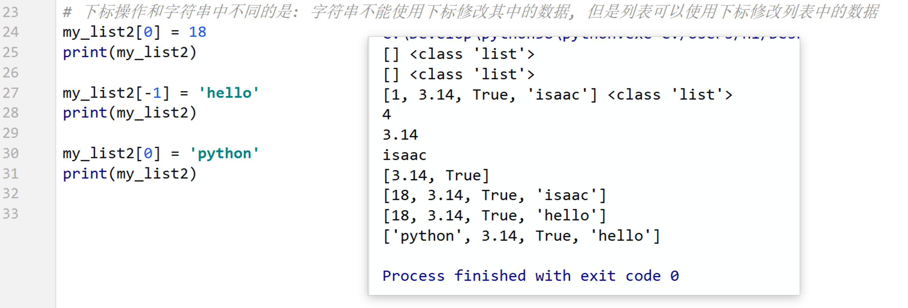


### 2.2 遍历

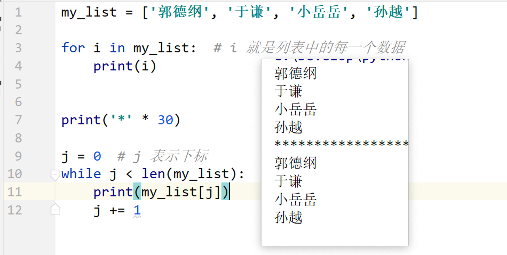

### 2.3 向列表中添加数据

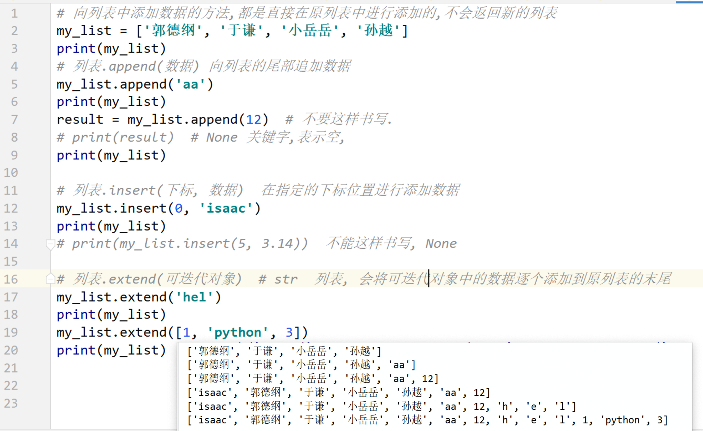

### 2.4 列表中的数据查询操作

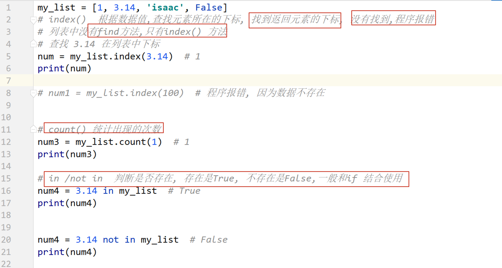

### 2.5 列表中的删除操作

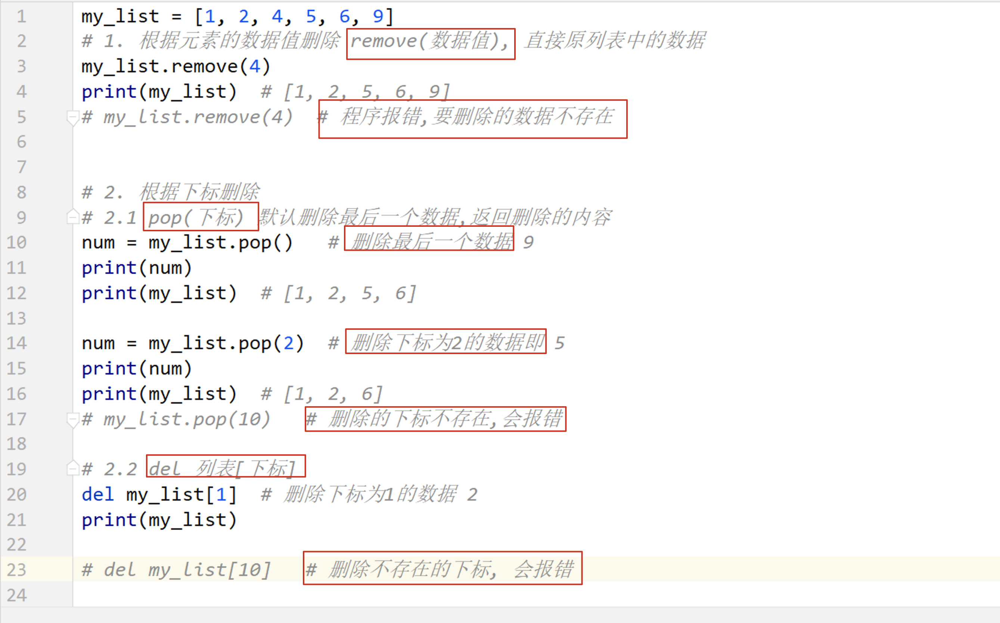

### 2.6 列表排序和逆置


### 2.7 列表嵌套


### 2.8 案例: 分配办公室

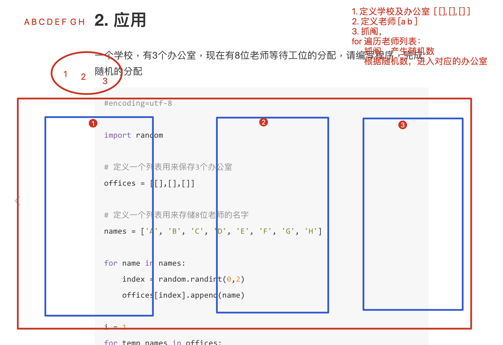

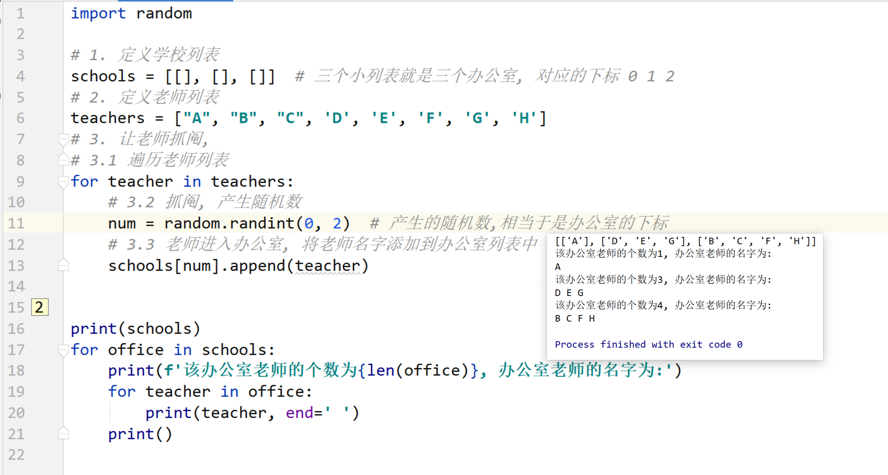


## 3. 元组

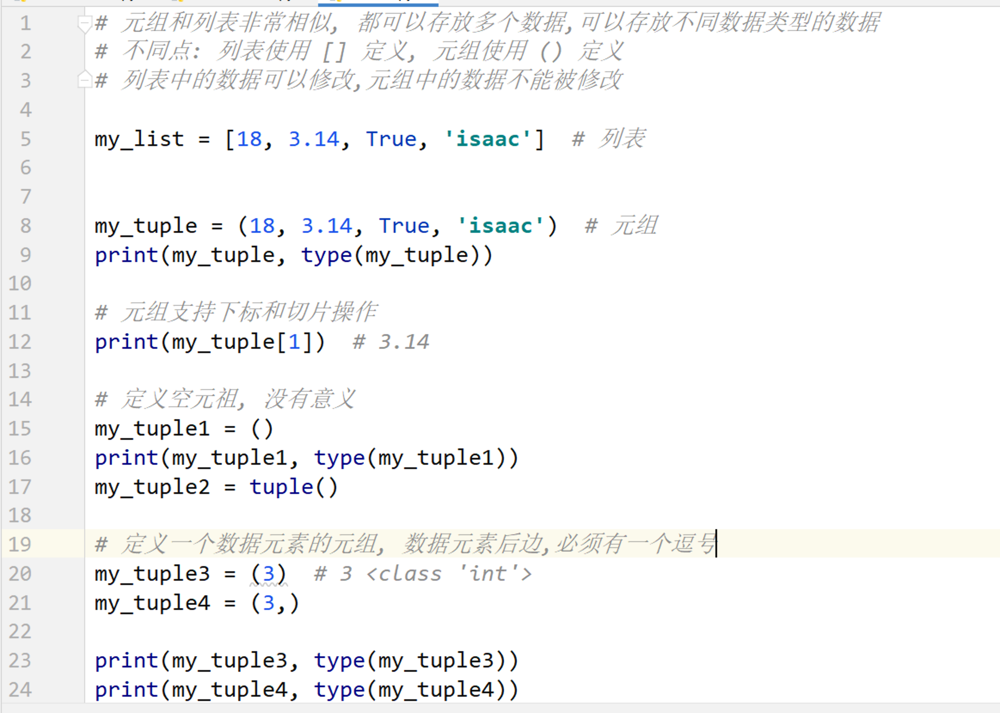