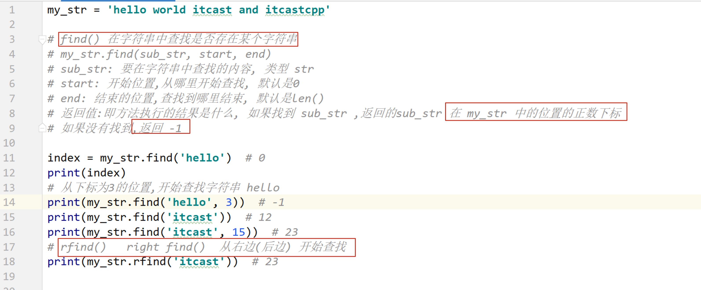
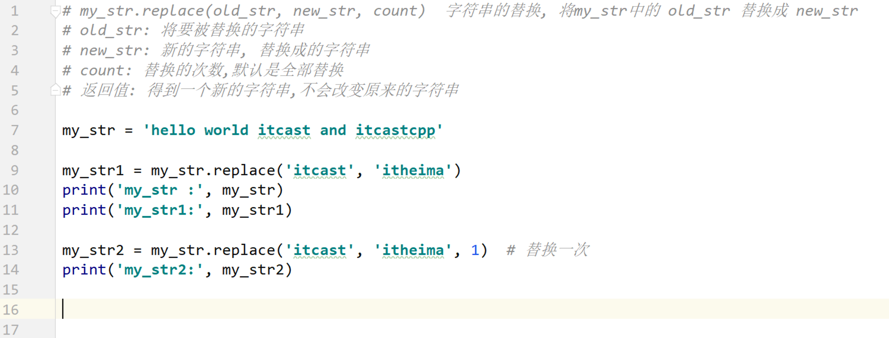
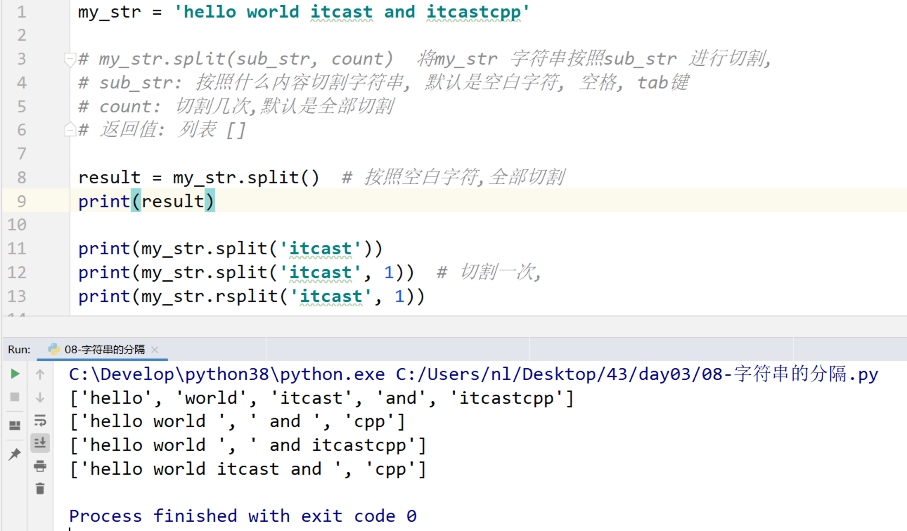
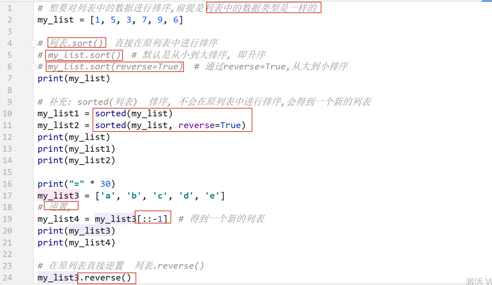
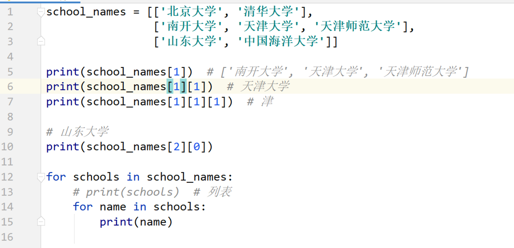

## Day03 笔记

[toc]

## 复习和反馈


## 1. 字符串

### 1.1 字符串定义

```python
带引号的内容就是字符串.

在 python 中,字符串可以乘上一个整数, 
字符串 * num
```


### 1.2 字符串的输出和输出

```python
# 输入 input()
input() 函数得到的内容就是字符串

# 输出 print() 函数 %s 
f-string 
```

### 1.3 下标


### 1.4 切片

```python
my_str[:]  得到和原来一样的字符串
my_str[::-1]  字符串的逆置
```


### 1.5 查找方法

#### find() & rfind()



#### index & rindex()


#### count()


### 1.6 字符串替换方法 replace



#### 1.7 字符串分隔 split()



#### 1.8 字符串连接 join()


## 2. 列表

### 2.1 列表的定义和基本使用


### 2.2 遍历


### 2.3 向列表中添加数据


### 2.4 列表中的数据查询操作


### 2.5 列表中的删除操作


### 2.6 列表排序和逆置



### 2.7 列表嵌套



### 2.8 案例: 分配办公室


## 3. 元组

